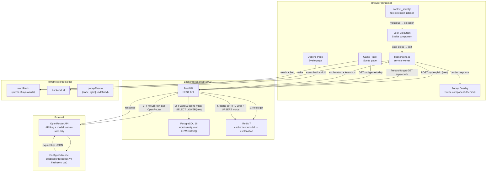

# Architecture Overview — Vocab Chrome Extension

## Executive Summary

A personal English vocabulary learning tool for a single Vietnamese developer, consisting of a Chrome Extension (Manifest V3, built with Svelte 5 + Vite) and a FastAPI backend running on localhost via Docker Compose. When the user highlights text on any webpage, a floating popup appears with an AI-generated explanation; the extension never calls OpenRouter directly — all LLM calls are made server-side by the FastAPI backend, which holds the API key exclusively. The LLM model is hardcoded in the backend via the `OPENROUTER_MODEL` env var (default `z-ai/glm-4.5-air:free`) — see [ADR 010](adr/010-hardcode-model-no-picker.md). Explanations are cached in Redis keyed on `(text, model)`, so repeated selections are instant and free. For single words, the backend auto-saves the result to PostgreSQL immediately; for sentences, the backend returns a list of keyword/phrasal verb chips that the user explicitly selects and saves. At end of day, a matching game lets the user review every word saved that session.

---

## System Architecture



---

## Component Breakdown

| Component | Technology | Responsibility |
|-----------|------------|----------------|
| content_script.js | JS injected into page | Detects text selection on `mouseup`; mounts a floating **"🔍 Look up" button** in a Shadow DOM near the selection; on click, mounts the full Popup Overlay (also Shadow DOM). Manages dismissal (click outside, Esc, new selection). Reads `popupTheme` to apply dark/light class. |
| Look-up button | Svelte (Shadow DOM) | Small pill button rendered next to a text selection. Click triggers the existing EXPLAIN flow. Respects theme (auto / dark / light). |
| background.js (service worker) | MV3 Service Worker | Relays EXPLAIN/SAVE/VOTE messages between content script and backend; reads `backendUrl` from `chrome.storage.local` |
| Popup Overlay | Svelte component (in-page) | Shows Vietnamese explanation, keyword chips for sentence flow, Save and 👍/👎 vote buttons; attached to page via Shadow DOM. **Themed** (dark / light, auto-detect by default, manual toggle in header, persisted in `chrome.storage.local.popupTheme`); no border; ~90% opacity background. |
| Options Page | Svelte page | User sets `backendUrl`; that's it. The LLM model is configured server-side. |
| Game Page | Svelte page | Tabbed UI — **Game** (matching game) and **Word Bank** (all queried words with filters/search/sort). Word Bank reads chrome.storage.local first, then refreshes from `GET /api/words`. |
| FastAPI Backend | Python + FastAPI | Calls OpenRouter with server-side API key + hardcoded model; manages words/votes; serves game data; owns all LLM communication |
| Redis 7 | Docker container | Cache for LLM responses keyed on `explain:{model}:{sha256(text)}`, TTL 30 days |
| PostgreSQL 16 | Docker container | Persistent store: `words` (text, explanation, pronunciation, example, `model_source`, `up_vote`, `down_vote`), `game_results` |
| OpenRouter | External API | Routes LLM requests to the configured model (env var `OPENROUTER_MODEL`, default `z-ai/glm-4.5-air:free`) |

---

## Data Flows

### Single Word Flow

```
1. User selects a single word on any webpage
2. mouseup fires → content_script.js reads window.getSelection()
2a. content_script mounts a small "🔍 Look up" button (Shadow DOM) at the selection's bottom-left
2b. User clicks the button → button is removed, popup-mount path begins
3. content_script sends message to background.js (service worker)
4. background.js reads backendUrl from chrome.storage.local
5. background.js POSTs { "text": "word", "source_url": "..." }
   to POST /api/explain
6. Backend computes cache key = sha256(env-var model + ":" + lowercased text)
7. Backend checks Redis (GET explain:<model>:<hash>):
     - **HIT**  → returns cached explanation immediately (<100ms); also UPSERTs `words` row to bump query_count
     - **MISS** → continue
8. Backend treats the input as "wordish" if `len(text.split()) <= 2`. If wordish:
     - SELECT FROM words WHERE LOWER(text) = LOWER($1) LIMIT 1
     - **DB hit** → UPDATE query_count+1, last_queried_at=now(); hydrate Redis; return row's data with `db_hit=true`
     - **DB miss** → continue to LLM
9. On true miss, backend calls OpenRouter with the env-var model and Vietnamese-explanation prompt
10. Backend writes the response into Redis (TTL 30d)
11. Backend UPSERTs the word into PostgreSQL (INSERT ... ON CONFLICT (LOWER(text)) DO UPDATE) with the new fields (synonyms, collocations, difficulty), `model_source`, `up_vote=0`, `down_vote=0`, `query_count=1`
12. Backend returns explanation JSON (word id, model_source, current votes, synonyms, collocations, difficulty, query_count, cached flag, db_hit flag)
13. Popup Overlay renders Vietnamese explanation (~100 words), word_type + difficulty badges, IPA, English example, synonyms chips, collocations list
14. User reads, optionally clicks 👍 or 👎 (POST /api/words/{id}/vote)
15. Service worker fire-and-forget refreshes chrome.storage.local.wordBank from `GET /api/words`
16. User closes popup with X or Esc
```

### Sentence Flow

```
1. User selects a sentence or multi-word phrase on any webpage
2. mouseup fires → content_script.js reads window.getSelection()
2a. content_script mounts a small "🔍 Look up" button (Shadow DOM) at the selection's bottom-left
2b. User clicks the button → button is removed, popup-mount path begins
3. content_script sends message to background.js
4. background.js POSTs { "text": "sentence", "source_url": "..." }
   to POST /api/explain
5. Backend checks Redis cache (same key scheme as word flow); on miss, calls OpenRouter
6. Backend parses AI response: Vietnamese sentence-level explanation + keywords array
   (each keyword: text, word_type, pronunciation (IPA), Vietnamese explanation, English example)
7. Backend caches the response in Redis; does NOT auto-save to DB (sentence flow)
8. Popup Overlay renders:
   - Vietnamese sentence explanation at top (~100 words)
   - Scrollable row of keyword chips (text + word_type badge)
9. User clicks chips to toggle selection (outline → filled)
10. User clicks "Save selected" button
11. CE POSTs { source_sentence, source_url, keywords[] } to POST /api/words/save
12. Backend saves chosen keywords to PostgreSQL with `model_source` populated, `up_vote=0`, `down_vote=0`
13. Popup shows "Saved ✓" confirmation for 2 seconds, then closes
```

### Word Bank Flow (new)

```
1. User clicks the extension icon → game page opens with two tabs: Game | Word Bank
2. Word Bank tab on mount:
     - Reads chrome.storage.local.wordBank → renders cards immediately (instant load, works offline)
     - Sends SYNC_WORDBANK message to service worker
3. Service worker:
     - GET /api/words?limit=1000 from backend
     - Writes the array to chrome.storage.local.wordBank with a fresh wordBankSyncedAt timestamp
     - Returns the array to the tab
4. Tab replaces the rendered list with the fresh data
5. User can filter (search text, by difficulty, by word_type), sort (recent / most-queried / highest-voted / alphabetical), or click a card to expand details (synonyms chips, collocations list, example sentence)
6. Service worker also fire-and-forget syncs after every successful EXPLAIN / SAVE_KEYWORDS / VOTE, so the cache stays warm without the user opening the tab
```

### Vote Flow

```
1. After an explanation renders in the popup, user clicks 👍 or 👎
2. Popup sends VOTE message to service worker with { wordId, direction }
3. Service worker POSTs /api/words/{wordId}/vote with { direction: "up"|"down" }
4. Backend increments the corresponding counter on the words row, returns the updated word
5. Popup updates the visible counters
6. Future game and listing endpoints order by (up_vote - down_vote) DESC, created_at DESC
```

---

## Key Architectural Decisions

**API key is server-side only.** The `OPENROUTER_API_KEY` environment variable lives in the backend `.env` file and is read by Docker Compose. It never appears in the extension code, `chrome.storage.local`, or any browser context. See [ADR 001](adr/001-backend-owns-api-key.md).

**Svelte 5 + Vite for the CE.** Svelte compiles to plain JS at build time — no runtime overhead in the extension bundle. Scoped component styles combined with Shadow DOM prevent host-page CSS from leaking into the popup overlay. See [ADR 002](adr/002-svelte-for-ce.md).

**Differentiated save flow by input type.** Words are low-noise and always worth saving; sentences contain many words and the user should curate. Auto-saving sentence keywords would fill the DB with already-known words. See [ADR 003](adr/003-word-vs-sentence-save-flow.md).

**PostgreSQL over SQLite.** The system is designed for Kubernetes migration from day one. PostgreSQL in Docker is a direct lift-and-shift to a K8s StatefulSet or CloudNativePG operator. See [ADR 004](adr/004-postgresql-over-sqlite.md).

**Model is hardcoded in the backend.** The `OPENROUTER_MODEL` env var (default `z-ai/glm-4.5-air:free`) is the single source of truth. The extension does not send a `model` field. Earlier ADRs 006 (catalog sync job) and 007 (per-request model) were rolled back; see [ADR 010](adr/010-hardcode-model-no-picker.md).

**Redis-backed explanation cache.** LLM responses are cached at `explain:{model}:{sha256(text)}` with a 30-day TTL. The model id is constant now but still in the key, so a future model change creates a fresh namespace automatically. See [ADR 005](adr/005-redis-for-llm-cache.md).

**Vietnamese explanations (~100 words).** The system prompt instructs the model to write the `explanation` field in Vietnamese, targeting 50–150 words. `word_type`, `pronunciation` (IPA), and `example` (English sentence) remain in English/IPA — these are study targets, not study aids. See [ADR 008](adr/008-vietnamese-explanations.md).

**Word-level voting for review prioritization.** Each saved word has integer `up_vote` / `down_vote` counters and a `model_source` column (recording which model produced the explanation). Listings and the matching game order by net score, surfacing the most "I want to study this more" words first. No per-user vote tracking (single-user tool). See [ADR 009](adr/009-word-voting.md).
